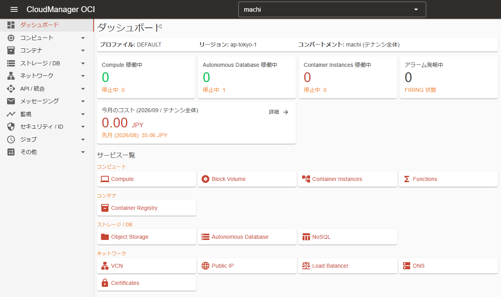

# CloudManager OCI

ローカルの OCI プロファイルを使って Oracle Cloud Infrastructure のリソースを閲覧・操作する Web コンソールです。  
プロファイル、リージョン、コンパートメントを切り替えながら、Compute / Autonomous Database / Object Storage などのサービスを確認し、日常的な操作を実行し、cron で定期ジョブをスケジュールできます。



## ✨ 機能

| サービス | 一覧 | 操作 |
| --- | --- | --- |
| Compute | ✅ | 起動 / 停止 / 再起動 / 終了 / コマンド実行(Instance Agent) / メトリクス |
| Block Volume | ✅ | アタッチ / デタッチ / バックアップ作成 |
| Container Instances | ✅ | 起動 / 停止 / 再起動 / コンテナ一覧 |
| Functions | ✅ | 呼び出し / 構成 / プロビジョニング済み同時実行数 |
| Container Registry (OCIR) | ✅ | イメージ一覧 / イメージ削除 |
| Object Storage | ✅ | アップロード / ダウンロード / 削除 / プレビュー / コピー・移動 / バージョン / ライフサイクル / アクセス設定 |
| Autonomous Database | ✅ | 起動 / 停止 / 再起動 / バックアップ(作成・復元・削除) / 接続文字列 / 作業リクエスト |
| NoSQL Database | ✅ | クエリ / スキーマ |
| VCN | ✅ | サブネット / ルート表 / セキュリティリスト / NSG / ゲートウェイ |
| Public IP | ✅ | 割当 / 割当解除 |
| Load Balancer / Network Load Balancer | ✅ | バックエンドセット / バックエンドヘルス |
| DNS | ✅ | レコードの追加 / 更新 / 削除 |
| Certificates | ✅ | 証明書の詳細 |
| API Gateway | ✅ | デプロイメント一覧 |
| Events | ✅ | ルールの有効化 / 無効化 |
| Queue | ✅ | 送信 / 受信 / 削除 / パージ |
| Notifications | ✅ | サブスクリプション / 発行 |
| Monitoring | ✅ | アラーム / メトリクス(MQL) |
| Logging | ✅ | ロググループ / ログ / ログ検索 |
| Vault | ✅ | シークレット値の参照 / ローテーション |
| Identity Domains | ✅ | ユーザー一覧 / パスワードリセット / パスワード設定 |
| Bastion | ✅ | セッションの作成 / 削除 / SSH コマンド |
| Resource Search | - | 構造化クエリによる横断検索 |
| Cost | - | Usage API による月次コスト(サービス別・日次推移) |

## 🔐 前提条件

CloudManager は実行するマシン上の OCI プロファイル(`~/.oci/config`)を使用します。利用前に OCI CLI などでプロファイルと API キーを設定してください。

```ini
# ~/.oci/config
[DEFAULT]
user=ocid1.user.oc1..aaaaaaaaexample
fingerprint=20:3b:97:13:55:1c:5b:0d:d3:37:d8:50:4e:c5:3a:34
tenancy=ocid1.tenancy.oc1..aaaaaaaaexample
region=ap-tokyo-1
key_file=~/.oci/oci_api_key.pem
```

## 🧭 使い方

### 🔄 プロファイル、リージョン、コンパートメント

ダッシュボードには現在のプロファイル、リージョン、コンパートメントが表示されます。**設定** を開くと `~/.oci/config` にあるプロファイルと購読リージョンへ切り替えられ、コンパートメントはアプリバーのセレクタからいつでも変更できます。  
変更はすぐにすべてのページへ反映されます。

一覧は選択したコンパートメントとその配下のコンパートメントを対象にします。テナンシのルートを選ぶとテナンシ全体が対象になり、各一覧にコンパートメント列が表示されます。

### 🖥️ リソースの閲覧と操作

各サービスには専用のページがあり、ナビゲーションメニューまたはダッシュボードから開けます。一覧は絞り込みと再読み込みができ、行の操作からダイアログを開いて各種操作を実行します。  
破壊的な操作(終了、削除、復元、パージなど)では確認を求め、必要に応じてリソース識別子の入力を要求します。時間のかかる操作は、リソースが目的の状態になるまで進捗を表示します。

### 📦 Object Storage

バケットとオブジェクトはプレフィックス単位で辿れます。オブジェクトはブラウザからのアップロード、ダウンロード、プレビュー(画像・テキスト)、コピー・移動ができ、バージョンの復元も可能です。  
バケット単位のライフサイクルルールとアクセス設定はバケット一覧から操作できます。

### 🔎 リソース検索

**リソース検索** では Resource Search の構造化クエリ(`query instance resources where lifecycleState = 'RUNNING'` など)でテナンシ全体のリソースを横断的に検索できます。結果は最大 500 件です。

### ⏰ 定期ジョブ

**ジョブ一覧** では cron 式で定期的な操作をスケジュールできます。

- Compute インスタンスの起動 / 停止 / 再起動
- Autonomous Database の起動 / 停止
- Container Instance の起動 / 停止
- Functions の呼び出し

各ジョブは固有のプロファイルとリージョンで実行され、cron 式は UTC またはローカル時刻で評価できます。ジョブは即時実行もでき、すべての実行は結果とエラー詳細とともに **実行履歴** に記録されます。

## ⚙️ 設定

| キー | 説明 |
| --- | --- |
| `Oci:DefaultProfile` | 起動時に選択されるプロファイル |
| `Oci:DefaultRegion` | 起動時に選択されるリージョン(未指定時はプロファイルの `region`) |
| `Oci:DefaultCompartmentId` | 起動時に選択されるコンパートメントの OCID(未指定時はテナンシのルート) |
| `Job:LogRetentionCountPerJob` | ジョブごとに保持する実行履歴の件数 |
| `ConnectionStrings:Default` | ジョブ定義と実行履歴を保存する SQLite データベース(自動作成) |
